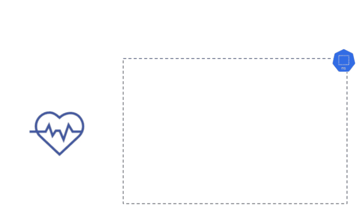

## <center>**Kuberhealthy** - The Kubernetes operator for synthetic checks!</center>

[](https://opensource.org/licenses/Apache-2.0)
[](https://goreportcard.com/report/github.com/kuberhealthy/kuberhealthy)
[](https://bestpractices.coreinfrastructure.org/projects/2822)
[](https://twitter.com/kuberhealthy)  
[](https://kubernetes.slack.com/messages/CB9G7HWTE)

Kuberhealthy is a [Kubernetes operator](https://kubernetes.io/docs/concepts/extend-kubernetes/operator/) for [synthetic monitoring](https://en.wikipedia.org/wiki/Synthetic_monitoring) and [continuous process verification](https://en.wikipedia.org/wiki/Software_verification_and_validation). You can [write your own test containers](docs/CHECK_CREATION.md) in any language or [deploy one of the included ones](docs/CHECKS_REGISTRY.md) and Kuberhealthy will run them and produce metrics for [Prometheus](https://prometheus.io). Includes a simple JSON status page for custom integrations. Kuberhealthy is a **[CNCF Sandbox Project](https://www.cncf.io/sandbox-projects/)**.


### A Check in Action

Here is a step by step illustration of Kuberhealthy running the included deployment check that tests the creation and tear down of a Kubernetes deployment:




## TLDR Installation Instructions

1. Install Kuberhealthy into your cluster:

   ```sh
   kubectl apply -k github.com/kuberhealthy/kuberhealthy/deploy/kustomize
   ```

2. Forward the Kuberhealthy service to your local machine:

   ```sh
   kubectl -n kuberhealthy port-forward svc/kuberhealthy 8080:8080
   ```

3. Visit [http://localhost:8080](http://localhost:8080) to view the status page.

4. Create a [HealthCheck](docs/CHECKS_REGISTRY.md) with `kubectl apply`.

For advanced configuration options, see the [deployment guide](docs/deployingKuberhealthy.md).

## Client Libraries and Examples

Kuberhealthy offers starter codebases for making your own check pods and provides client packages for a variety of languages:

- [Rust](https://github.com/kuberhealthy/rust)
- [TypeScript](https://github.com/kuberhealthy/typescript)
- [JavaScript](https://github.com/kuberhealthy/javascript)
- [Go](https://github.com/kuberhealthy/go)
- [Python](https://github.com/kuberhealthy/python)
- [Ruby](https://github.com/kuberhealthy/ruby)
- [Java](https://github.com/kuberhealthy/java)
- [Bash](https://github.com/kuberhealthy/bash)

## Learn More

- 🧠 [How Kuberhealthy Works](docs/howItWorks.md)
- 🚀 [Deploying Kuberhealthy](docs/deployingKuberhealthy.md)
- 📊 [Viewing Check Status](docs/howItWorks.md#using-the-json-status-page)
- 🛠️ [Creating Your Own `HealthCheck`](docs/CHECK_CREATION.md)
- 🗂️ [HealthCheck Registry](docs/CHECKS_REGISTRY.md)

## Contributing

If you're interested in contributing to this project, we want your help!
- Check out the [Contributing Guide](docs/CONTRIBUTING.md).
- If you use Kuberhealthy in a production environment, add yourself to the list of [Kuberhealthy adopters](docs/ADOPTERS.md)!
- Check out [open issues](https://github.com/kuberhealthy/kuberhealthy/issues). If you're new to the project, look for the `good first issue` tag.
- We're always looking for [check contributions](docks/CHECKS_REGISTRY.md) (either in suggestions or in PRs) as well as feedback from folks implementing Kuberhealthy locally or in a test environment.

## Monthly Community Meeting

If you would like to talk directly to the core maintainers to discuss ideas, code reviews, or other complex issues, we have a monthly Zoom meeting on the **24th day** of every month at **04:30 PM Pacific Time**.  

[Click here to download the invite file](https://zoom.us/meeting/tJIlcuyrqT8qHNWDSx3ZozYamoq2f0ruwfB0/ics?icsToken=98tyKuCupj4vGdORsB-GRowAGo_4Z-nwtilfgo1quCz9UBpceDr3O-1TYLQvAs3H) or [click here to join the zoom meeting right now (968 5537 4061)](https://zoom.us/j/96855374061).
