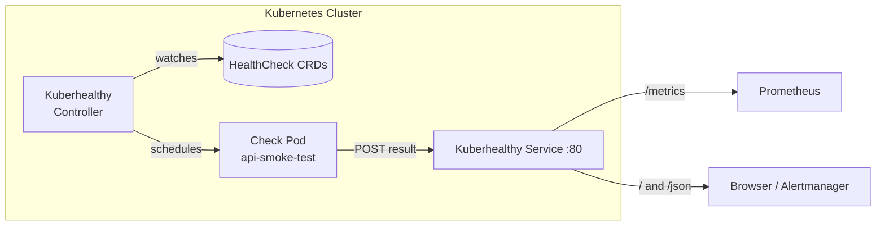

<p align="center">
  
</p>

# Kuberhealthy

**Kuberhealthy is an operator for [synthetic monitoring](https://en.wikipedia.org/wiki/Synthetic_monitoring) and [continuous validation](https://en.wikipedia.org/wiki/Software_verification_and_validation). It ships metrics to Prometheus and enables you to package your synthetic monitoring as Kubernetes manifests.**

[](https://opensource.org/licenses/Apache-2.0)
[](https://goreportcard.com/report/github.com/kuberhealthy/kuberhealthy)
[](https://bestpractices.coreinfrastructure.org/projects/2822)
[](https://github.com/kuberhealthy/kuberhealthy/actions/workflows/tests.yml)
[](https://github.com/kuberhealthy/kuberhealthy/releases)
[](https://kubernetes.slack.com/messages/CB9G7HWTE)

---

## Why Kuberhealthy?

Most synthetic monitoring tools can only probe HTTP endpoints. Kuberhealthy runs full Kubernetes pods as checks — which means your monitoring logic can:

- **Authenticate with your cluster** — use ServiceAccounts, Secrets, and internal DNS natively
- **Run multi-step workflows** — simulate a real user: log in, create a record, verify it, clean it up
- **Use any language** — [Go](https://github.com/kuberhealthy/go), [Python](https://github.com/kuberhealthy/python), [Rust](https://github.com/kuberhealthy/rust), [bash](https://github.com/kuberhealthy/bash), or anything that fits in a container
- **Own your checks as code** — checks are Kubernetes manifests, so ship them alongside your app!

---

## How it works


```mermaid
flowchart LR
    subgraph cluster[Kubernetes Cluster]
        controller[Kuberhealthy\nController]
        crd[(HealthCheck CRDs)]
        pod1[Check Pod\napi-smoke-test]
        svc[Kuberhealthy Service :80]
    end
    prom[Prometheus]
    ui[Browser / Alertmanager]

    controller -- watches --> crd
    controller -- schedules --> pod1
    pod1 -- POST result --> svc
    svc -- /metrics --> prom
    svc -- / and /json --> ui
```

Kuberhealthy provides the `HealthCheck` custom resource definition. Each `HealthCheck` tells Kuberhealthy to start a short-lived checker pod on a schedule. The pod runs your validation logic, then reports `ok: true` or `ok: false` back to Kuberhealthy. Results flow to the built-in status UI, JSON API (`/json`), and Prometheus metrics (`/metrics`).

---

## Getting started

Installing Kuberhealthy is easy. Just apply the kustomize, ArgoCD, or Helm manifests and you're ready to start applying `healthcheck` resources.

1. Install Kuberhealthy to your cluster:

   **Helm** (recommended)
   ```sh
   helm install kuberhealthy deploy/helm/kuberhealthy -n kuberhealthy --create-namespace
   ```

   **Kustomize**
   ```sh
   kubectl apply -k github.com/kuberhealthy/kuberhealthy/deploy/kustomize/base?ref=main
   ```

   **ArgoCD**
   ```sh
   kubectl apply -f deploy/argocd/kuberhealthy.yaml
   ```

2. Port-forward the service:

   ```sh
   kubectl -n kuberhealthy port-forward svc/kuberhealthy 8080:80
   ```

3. Open `http://localhost:8080` to see the status UI, then apply a [HealthCheck](docs/CHECKS_REGISTRY.md) or build your own (see [CHECK_CREATION.md](docs/CHECK_CREATION.md)).


## What a `healthcheck` CRD looks like

This is the core object Kuberhealthy manages. It tells the controller what pod to run, how often to run it, and how long to wait before considering the run failed. You can use `kubectl get healthcheck` or `kubectl get hc`.

```yaml
apiVersion: kuberhealthy.github.io/v1
kind: HealthCheck
metadata:
  name: api-smoke-test
  namespace: kuberhealthy
spec:
  # Run this check every 5 minutes.
  runInterval: 5m

  # If the pod has not reported back within 1 minute, mark the run failed.
  timeout: 1m

  # These labels are copied onto the checker pod and can also appear in metrics.
  extraLabels:
    kuberhealthy.io/category: api
    kuberhealthy.io/severity: page

  podSpec:
    metadata:
      labels:
        app: api-smoke-test
    spec:
      restartPolicy: Never
      containers:
        - name: main
          image: curlimages/curl:8.7.1
          command:
            - /bin/sh
            - -ec
            - |
              # Your container does the real validation work.
              curl -fsS https://example.com/health

              # Then it reports the result back to Kuberhealthy.
              curl -fsS -X POST \
                -H "Content-Type: application/json" \
                -H "kh-run-uuid: $KH_RUN_UUID" \
                -d '{"ok":true,"errors":[]}' \
                "$KH_REPORTING_URL"
```

Kuberhealthy injects these environment variables into every check pod:

| Variable | Description |
|---|---|
| `KH_REPORTING_URL` | POST your result here |
| `KH_RUN_UUID` | Include in the `kh-run-uuid` header to authenticate the report |
| `KH_CHECK_RUN_DEADLINE` | RFC3339 timestamp — your check must report before this time |
| `KH_POD_NAMESPACE` | Namespace the check pod is running in |

---

## Example Healthcheck Behavior

**`kubectl get healthcheck`**
```
NAME              NAMESPACE      LAST RUN    AGE    OK
api-smoke-test    kuberhealthy   2m ago      2d     true
```

**`/json`**
```json
{
  "ok": true,
  "checks": {
    "kuberhealthy/api-smoke-test": {
      "ok": true,
      "errors": [],
      "lastRun": "2024-01-15T14:32:01Z",
      "runDuration": "230ms"
    }
  }
}
```

**`/metrics`** (Prometheus)
```
kuberhealthy_check_status{check="api-smoke-test",namespace="kuberhealthy"} 1
kuberhealthy_check_status{check="db-connectivity",namespace="kuberhealthy"} 0
kuberhealthy_check_duration_seconds{check="api-smoke-test",namespace="kuberhealthy"} 0.23
kuberhealthy_check_pass_count{check="api-smoke-test",namespace="kuberhealthy"} 142
```

---
---

## Writing checks

Get started with [CHECK_CREATION.md](docs/CHECK_CREATION.md) and the [HealthCheck registry](docs/CHECKS_REGISTRY.md), then pick a check client for your language:

| Language | Client |
|---|---|
| [Go](https://github.com/kuberhealthy/go) | `github.com/kuberhealthy/kuberhealthy/v3/pkg/checkclient` |
| [Python](https://github.com/kuberhealthy/python) | `kuberhealthy` |
| [TypeScript](https://github.com/kuberhealthy/typescript) | `@kuberhealthy/kuberhealthy` |
| [JavaScript](https://github.com/kuberhealthy/javascript) | `@kuberhealthy/kuberhealthy` |
| [Rust](https://github.com/kuberhealthy/rust) | `kuberhealthy` |
| [Ruby](https://github.com/kuberhealthy/ruby) | `kuberhealthy` |
| [Java](https://github.com/kuberhealthy/java) | Maven / Gradle |
| [Bash](https://github.com/kuberhealthy/bash) | Shell script helper |

**Example: Go check that validates an internal API**

```go
package main

import (
    "fmt"
    "net/http"

    "github.com/kuberhealthy/kuberhealthy/v3/pkg/checkclient"
)

func main() {
    resp, err := http.Get("http://my-api.default.svc.cluster.local/health")
    if err != nil {
        checkclient.ReportFailure([]string{fmt.Sprintf("request failed: %s", err)})
        return
    }
    defer resp.Body.Close()

    if resp.StatusCode != http.StatusOK {
        checkclient.ReportFailure([]string{fmt.Sprintf("unexpected status %d from /health", resp.StatusCode)})
        return
    }

    checkclient.ReportSuccess()
}
```

The check client handles `KH_REPORTING_URL`, `KH_RUN_UUID`, and deadline enforcement automatically.

---

## Documentation

See the full documentation index in [docs/README.md](docs/README.md).

---

## Adopters

Organizations running Kuberhealthy in production:

| Organization | Industry |
|---|---|
| [Adobe](https://www.adobe.com) | Software |
| [Jenkins X](https://jenkins-x.io) | CI/CD |
| Meltwater | Media Intelligence |
| Mercedes-Benz | Automotive |
| Polarpoint | Consulting |

Running Kuberhealthy in production? [Add yourself to the adopters list.](docs/ADOPTERS.MD)

---

## Contributing

- Read the [Contributing Guide](docs/CONTRIBUTING.MD) before opening a PR.
- Browse [open issues](https://github.com/kuberhealthy/kuberhealthy/issues) — new contributors should look for the `good first issue` tag.
- Check contributions are especially welcome — see the [HealthCheck registry](docs/CHECKS_REGISTRY.md) for gaps.
- Have feedback from running Kuberhealthy in production? Open a discussion or join Slack.

---

## Community

- **Slack**: [`#kuberhealthy`](https://kubernetes.slack.com/messages/CB9G7HWTE) in the Kubernetes Slack workspace
- **Monthly call**: Every **24th** of the month at **4:30 PM Pacific** — [download invite](https://zoom.us/meeting/tJIlcuyrqT8qHNWDSx3ZozYamoq2f0ruwfB0/ics?icsToken=98tyKuCupj4vGdORsB-GRowAGo_4Z-nwtilfgo1quCz9UBpceDr3O-1TYLQvAs3H) · [join now](https://zoom.us/j/96855374061)
- **Issues**: [github.com/kuberhealthy/kuberhealthy/issues](https://github.com/kuberhealthy/kuberhealthy/issues)
