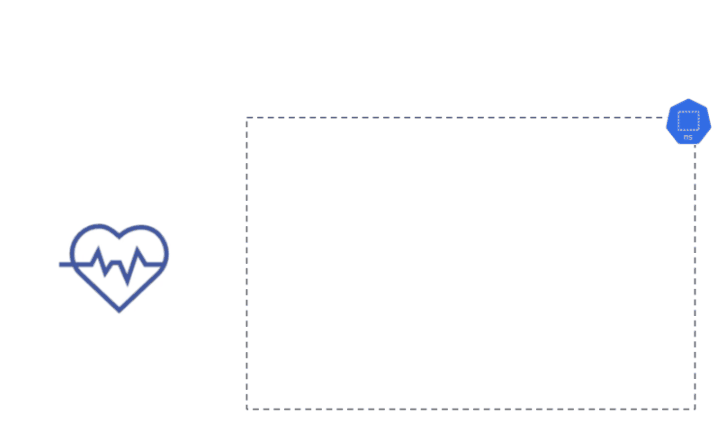

## Daemonset Check

The *Daemonset Check* ensures that Daemonsets can be deployed and terminated on all nodes in the cluster. When the spec
is applied to your cluster, Kuberhealthy recognizes it as a KHCheck resource and provisions a checker pod to run the
Daemonset Check. The Daemonset Check deploys a Daemonset, and waits for all the daemonset pods to be in the 'Ready'
state, then terminates them and ensures all pod terminations were successful.

The check runs every 15 minutes (spec.runInterval), with a check timeout set to 12 minutes (spec.timeout). If the check
does not complete within the given timeout it will report a timeout error on the status page.

Containers are deployed with their resource requirements set to 0 cores and 0 memory and use the pause container from
Google (gcr.io/google_containers/pause:0.8.0), which is likely already cached on your nodes. The pause container is already used by kubelet to do various tasks and should be cached at all times. The node-role.kubernetes.io/master
NoSchedule taint is tolerated by daemonset testing pods. The Daemonset Check respects a comma separated list of `key=value` node selectors with the `NODE_SELECTOR` environment variable. If a failure occurs anywhere in the daemonset deployment or tear down, an error is shown on the status page describing the issue.

#### Daemonset Check Kube Spec:

```$xslt
apiVersion: comcast.github.io/v1
kind: KuberhealthyCheck
metadata:
  name: daemonset
  namespace: kuberhealthy
spec:
  runInterval: 15m
  # Make sure this Kuberhealthy check timeout is GREATER THAN the daemonset checker timeout
  # set in the env var CHECK_POD_TIMEOUT. Default is set to 5m (5 minutes).
  timeout: 12m
  extraAnnotations:
    comcast.com/testAnnotation: test.annotation
  extraLabels:
    testLabel: testLabel
  podSpec:
    containers:
      - env:
          - name: POD_NAMESPACE
            value: "kuberhealthy"
          - name: NODE_SELECTOR # Schedules daemonsets only to nodes with this label
            value: "kubernetes.io/os=linux"
        image: kuberhealthy/daemonset-check:v3.3.0
        imagePullPolicy: IfNotPresent
        name: main
        resources:
          requests:
            cpu: 10m
            memory: 50Mi
```

#### Daemonset Check Env Vars:

| Env Var | Default |
| :--- | :--- |
|POD_NAMESPACE|"kuberhealthy"|
|PAUSE_CONTAINER_IMAGE|"gcr.io/google-containers/pause:3.1"|
|SHUTDOWN_GRACE_PERIOD|1m|
|CHECK_DAEMONSET_NAME|"daemonset"|
|DAEMONSET_PRIORITY_CLASS_NAME|""|
|NODE_SELECTOR|`<none>`|
|TOLERATIONS|""|
|ALLOWED_TAINTS|"node.kubernetes.io/unschedulable:NoSchedule"|

#### Daemonset Check Diagram




#### How-to

To implement the Daemonset Check with Kuberhealthy, run:

`kubectl apply -f https://raw.githubusercontent.com/kuberhealthy/kuberhealthy/2.3.1/cmd/daemonset-check/daemonset-check.yaml`

The configuration file contains:
- KuberhealthyCheck
- Role
- Rolebinding
- Service
- Secret

The role, rolebinding, service, and secret are all required to create and delete all daemonsets and pods from the check
in the given namespaces you apply the KHCheck to. The assumed default service account does not give you the permissions
to do so.
