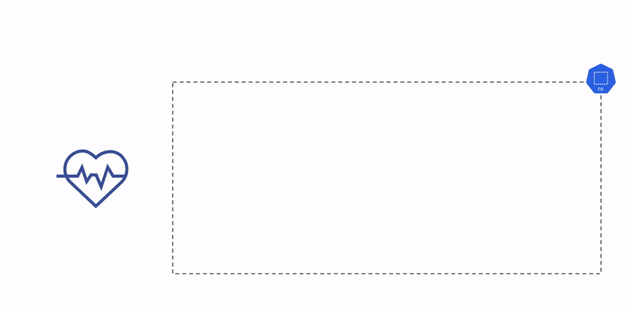

## Deployment and Service

This check tests if a `deployment` and `service` can be created within your Kubernetes cluster. It will attempt to bring up a `deployment` with `2` replicas and a `service` of type `ClusterIP` in the `kuberhealthy` namespace and waits for the pods to come up. Once the `deployment` is ready, the check makes a request to the hostname looking for a `200 OK`. The check then proceeds to terminate them and ensures that the `deployment` and `service` terminations were successful. A complete tear down of the `deployment` and `service` after receiving a `200 OK` marks a successful test run.

Container resource requests are set to `15 millicores` of CPU and `20Mi` units of memory and typically use an Nginx's image for the `deployment`. If the environment variable `CHECK_DEPLOYMENT_ROLLING_UPDATE` is set to `true`, the check will attempt to perform a rolling-update on the `deployment`. Once this rolling-update completes, the check makes another request to the hostname looking for a `200 OK` again before cleaning up. By default, the check will initially deploy Nginx's unprivileged `nginxinc/nginx-unprivileged:1.17.8` image, and update to `nginxinc/nginx-unprivileged:1.17.9`.

Custom images can be used for this check and can be specified with the `CHECK_IMAGE` and `CHECK_IMAGE_ROLL_TO` environment variables. If a custom image requires the use of environment variables, they can be passed down into your container by setting the environment variable `ADDITIONAL_ENV_VARS` to a string of comma-separated values (`"X=foo,Y=bar"`).

The number of replicas the `deployment` brings up can be adjusted with the `CHECK_DEPLOYMENT_REPLICAS` environment variable. By default the amount of replicas used is `2`, but this can be customized for different scenarios and environments. `maxSurge` and `maxUnavailable` values for the `deployment` is calculated to be `%50` of the `deployment` replicas (_rounded-up_).

A successful run implies that a `deployment` and service can be brought up and the corresponding hostname endpoint returns a `200 OK` response. A failure implies that an error occurred anywhere in the deployment creation, service creation, HTTP request, or tear down process -- resulting in an error report to the _Kuberhealthy_ status page.

#### Deployment Check Diagram



#### Check Steps

This check follows the list of actions in order during the run of the check:

1.  Looks for old `services` and `deployments` belonging to this check and cleans them up.
2.  Creates a `deployment` configuration, applies it to the namespace, and waits for the `deployment` to come up.
3.  Creates a `service` configuration, applies it to the namespace, and waits for the `service` to come up.
4.  Makes an HTTP Get request to the `service` endpoint, looking for a `200 OK`.

**IF ROLLING-UPDATE OPTION IS ENABLED**

5.  Creates an updated `deployment` configuration, applies it to the namespace, and waits for the deployment to complete its rolling-update.
6.  Makes a second HTTP Get request to the `service` endpoint, looking for another `200 OK`.

#### Check Details

- Namespace: kuberhealthy
- Timeout: 15 minutes
- Check Interval: 30 minutes
- Check name: `deployment`

#### Check Configuration Environment Variables

- `CHECK_IMAGE`: Initial container image. (default=`nginxinc/nginx-unprivileged:1.17.8`)
- `CHECK_IMAGE_ROLL_TO`: Container image to roll to. (default=`nginxinc/nginx-unprivileged:1.17.9`)
- `CHECK_IMAGE_PULL_SECRET`: Name of Image Pull Secret to use for above images. 
- `CHECK_DEPLOYMENT_NAME`: Name for the check's deployment. (default=`deployment-deployment`)
- `CHECK_SERVICE_NAME`: Name for the check's service. (default=`deployment-svc`)
- `CHECK_NAMESPACE`: Namespace for the check (default=`kuberhealthy`) The namespace that the `khcheck` CRD lives in will override this value.
- `CHECK_DEPLOYMENT_REPLICAS`: Number of replicas in the deployment (default=`2`).
- `CHECK_DEPLOYMENT_ROLLING_UPDATE`: Boolean to enable rolling-update (default=`false`).
- `CHECK_CONTAINER_PORT`: Check pod container port (default=`8080`).
- `CHECK_POD_CPU_REQUEST`: Check pod deployment CPU request value. Calculated in decimal SI units (`15 = 15m cpu`).
- `CHECK_POD_CPU_LIMIT`: Check pod deployment CPU limit value. Calculated in decimal SI units (`75 = 75m cpu`).
- `CHECK_POD_MEM_REQUEST`: Check pod deployment memory request value. Calculated in binary SI units (`20 * 1024^2 = 20Mi memory`).
- `CHECK_POD_MEM_LIMIT`: Check pod deployment memory limit value. Calculated in binary SI units (`75 * 1024^2 = 75Mi memory`).
- `NODE_SELECTOR`: Comma separated list of `key=value` node selector values for the deployment check. By default, there are no selectors.
- `TOLERATIONS`: Toleration values to respect on the deployment. By default, there are no tolerations.
- `ADDITIONAL_ENV_VARS`: Comma separated list of `key=value` variables passed into the pod's containers.
- `SHUTDOWN_GRACE_PERIOD`: Amount of time in seconds the shutdown will allow itself to clean up after an interrupt signal (default=`30s`).
- `DEBUG`: Verbose debug logging.


#### Example KuberhealthyCheck Spec

The following configuration will create a deployment with 4 replicas and roll from `nginx:1.17-perl` to `nginx:1.17.5-perl`:

```yaml
apiVersion: comcast.github.io/v1
kind: KuberhealthyCheck
metadata:
  name: deployment
  namespace: kuberhealthy
spec:
  runInterval: 10m
  timeout: 15m
  podSpec:
    containers:
      - name: deployment
        image: kuberhealthy/deployment-check:v1.9.0
        env:
          - name: CHECK_IMAGE
            value: "nginx:1.17-perl"
          - name: CHECK_IMAGE_ROLL_TO
            value: "nginx:1.17.5-perl"
          - name: CHECK_DEPLOYMENT_REPLICAS
            value: "4"
          - name: CHECK_DEPLOYMENT_ROLLING_UPDATE
            value: "true"
        resources:
          requests:
            cpu: 25m
            memory: 15Mi
          limits:
            cpu: 1
    restartPolicy: Never
    serviceAccountName: deployment-sa
    terminationGracePeriodSeconds: 60
```

The following configuration will create a deployment with 6 replicas and roll from `nginxinc/nginx-unprivileged:1.17.8` to `nginxinc/nginx-unprivileged:1.17.9`:

```yaml
apiVersion: comcast.github.io/v1
kind: KuberhealthyCheck
metadata:
  name: deployment
  namespace: kuberhealthy
spec:
  runInterval: 10m
  timeout: 15m
  podSpec:
    containers:
      - name: deployment
        image: kuberhealthy/deployment-check:v1.9.0
        env:
          - name: CHECK_DEPLOYMENT_REPLICAS
            value: "6"
          - name: CHECK_DEPLOYMENT_ROLLING_UPDATE
            value: "true"
        resources:
          requests:
            cpu: 25m
            memory: 15Mi
          limits:
            cpu: 1
    restartPolicy: Never
    serviceAccountName: deployment-sa
    terminationGracePeriodSeconds: 60
```

#### Install

To use the _Deployment Check_ with Kuberhealthy, apply the configuration file [deployment-check.yaml](deployment-check.yaml) to your Kubernetes Cluster. The following command will also apply the configuration file to your current context:

`kubectl apply -f https://raw.githubusercontent.com/kuberhealthy/kuberhealthy/master/cmd/deployment-check/deployment-check.yaml`

The check configuration file contains:

- KuberhealthyCheck
- Role
- Rolebinding
- ServiceAccount

The role, rolebinding, and service account are all required to create and delete all deployments and services from the check in the given namespaces you install the check for. The assumed default service account does not provide enough permissions for this check to run.
